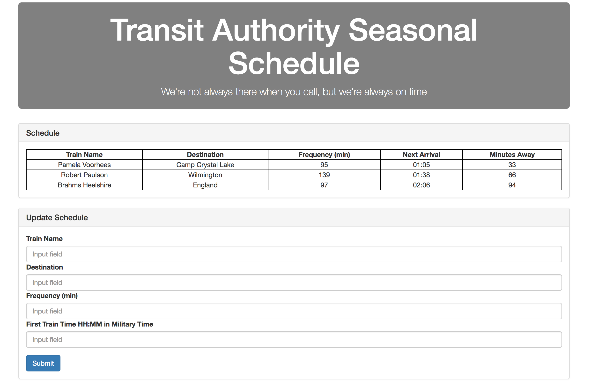

# Train-Schedule

## Definition

This is a web-based model of a train schedule. The user can add a new train to the schedule and see how many minutes away based on the frequency of the train.

_When will your train come in?_

## Prerequisites

Someone refactoring or forking this repository should add their own Firebase credentials to be able to review how the data is being stored.

## Technologies Used

- HTML
- CSS
- Javascript
- jQuery - jquery.com
- Bootstrap - getbootstrap.com
- Firebase - firebase.google.com
- MomentJS - momentjs.com

## Built With

Visual Studio Code

## Screenshot

## Author

Mark Powalisz
